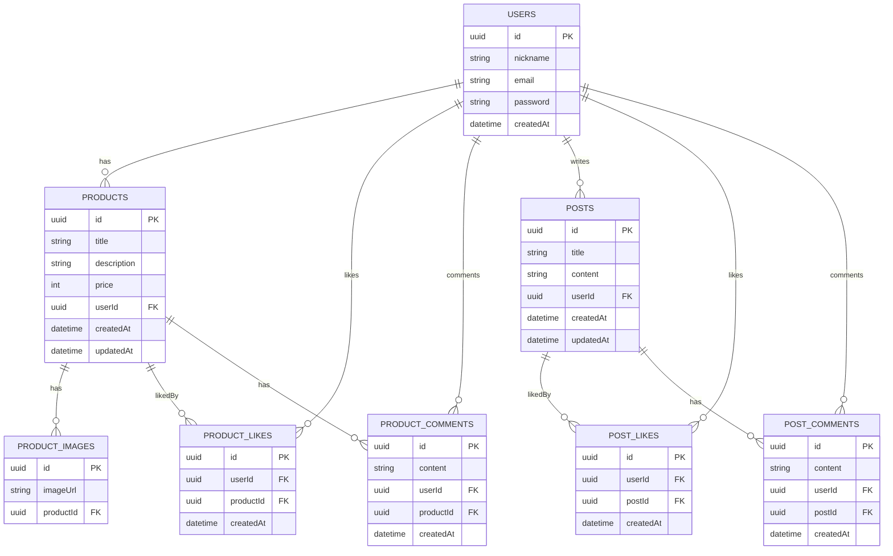

```mermaid
erDiagram

  USERS {
    uuid id PK
    string nickname
    string email
    string password
    datetime createdAt
  }

  PRODUCTS {
    uuid id PK
    string title
    string description
    int price
    uuid userId FK
    datetime createdAt
    datetime updatedAt
  }

  PRODUCT_IMAGES {
    uuid id PK
    string imageUrl
    uuid productId FK
  }

  PRODUCT_LIKES {
    uuid id PK
    uuid userId FK
    uuid productId FK
    datetime createdAt
  }

  PRODUCT_COMMENTS {
    uuid id PK
    string content
    uuid userId FK
    uuid productId FK
    datetime createdAt
  }

  POSTS {
    uuid id PK
    string title
    string content
    uuid userId FK
    datetime createdAt
    datetime updatedAt
  }

  POST_LIKES {
    uuid id PK
    uuid userId FK
    uuid postId FK
    datetime createdAt
  }

  POST_COMMENTS {
    uuid id PK
    string content
    uuid userId FK
    uuid postId FK
    datetime createdAt
  }

  USERS ||--o{ PRODUCTS : has
  USERS ||--o{ PRODUCT_LIKES : likes
  USERS ||--o{ PRODUCT_COMMENTS : comments
  USERS ||--o{ POSTS : writes
  USERS ||--o{ POST_LIKES : likes
  USERS ||--o{ POST_COMMENTS : comments

  PRODUCTS ||--o{ PRODUCT_IMAGES : has
  PRODUCTS ||--o{ PRODUCT_LIKES : likedBy
  PRODUCTS ||--o{ PRODUCT_COMMENTS : has

  POSTS ||--o{ POST_LIKES : likedBy
  POSTS ||--o{ POST_COMMENTS : has

```
