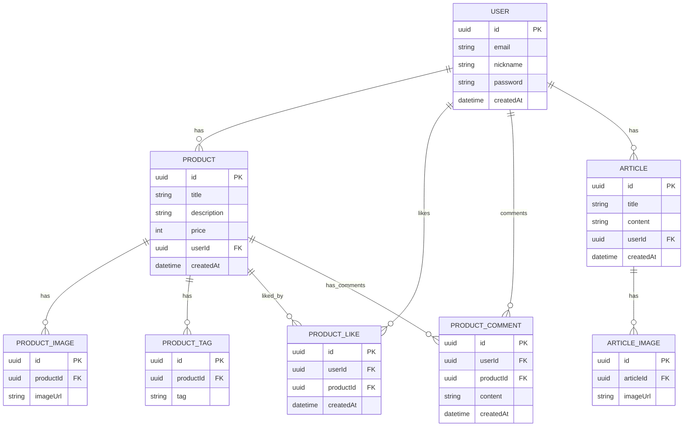

```mermaid
erDiagram

  USER {
    uuid id PK
    string email
    string nickname
    string password
    datetime createdAt
  }

  PRODUCT {
    uuid id PK
    string title
    string description
    int price
    uuid userId FK
    datetime createdAt
  }

  PRODUCT_IMAGE {
    uuid id PK
    uuid productId FK
    string imageUrl
  }

  PRODUCT_TAG {
    uuid id PK
    uuid productId FK
    string tag
  }

  PRODUCT_LIKE {
    uuid id PK
    uuid userId FK
    uuid productId FK
    datetime createdAt
  }

  PRODUCT_COMMENT {
    uuid id PK
    uuid userId FK
    uuid productId FK
    string content
    datetime createdAt
  }

  ARTICLE {
    uuid id PK
    string title
    string content
    uuid userId FK
    datetime createdAt
  }

  ARTICLE_IMAGE {
    uuid id PK
    uuid articleId FK
    string imageUrl
  }

  USER ||--o{ PRODUCT : has
  PRODUCT ||--o{ PRODUCT_IMAGE : has
  PRODUCT ||--o{ PRODUCT_TAG : has

  USER ||--o{ PRODUCT_LIKE : likes
  PRODUCT ||--o{ PRODUCT_LIKE : liked_by

  USER ||--o{ PRODUCT_COMMENT : comments
  PRODUCT ||--o{ PRODUCT_COMMENT : has_comments

  USER ||--o{ ARTICLE : has
  ARTICLE ||--o{ ARTICLE_IMAGE : has
```
